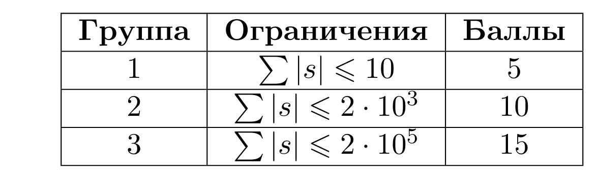

# Вставка символов

## Условие задачи

Изначально у Игоря была строка, состоящая из одинаковых символов. Над ней производилось некоторое количество операций вставки символа. Очередной символ можно вставить только между любыми двумя одинаковыми символами.

Вам дана строка 𝑠, состоящая из латинских символов как нижнего, так и верхнего регистра. Определите, могла ли эта строка получиться после некоторого (возможно нулевого) количества таких операций над ней.

## Входные данные

Каждый тест состоит из нескольких наборов входных данных.

Первая строка содержит целое число 𝑡 — количество наборов входных данных. (1≤𝑡≤10^5)

Каждый набор входных данных состоит из единственной строки 𝑠. (1≤∣𝑠∣≤2⋅10^5)

## Выходные данные

Для каждого набора входных данных выведите 'YES', если строка 𝑠 могла получиться после описанных операций, иначе выведите 'NO'.



В первом примере изначально строка имела вид 𝑎𝑎𝑎𝑎. Далее вставили символы 𝑏 и 𝑐 после первого и второго символа 𝑎 соответственно.

## Пример теста 1

### Входные данные

```
2
abacaa
PppP

```

### Выходные данные

```
YES
NO

```

## Пример теста 2

### Входные данные

```
2
X
kkk

```

### Выходные данные

```
YES
YES

```
