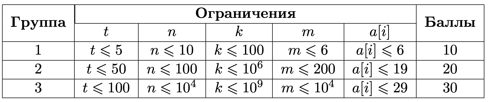

# Упаковка коробок

## Условие задачи

У вас есть 𝑛 машин, каждая грузоподъемностью 𝑘 килограмм. Вам дали заказ доставить 𝑚m коробок в другой город. Известно, что вес каждой коробки является степенью двойки, отсюда 𝑖-я коробка весит 2^𝑎[𝑖] килограмм. Для транспортировки вы используете все имеющиеся 𝑛 машин, в которые стараетесь погрузить максимальное количество груза. Определите, за какое минимальное число транспортировок вы сможете доставить все 𝑚 коробок.

## Входные данные

Каждый тест состоит из нескольких наборов входных данных.

Первая строка содержит целое число 𝑡 (1≤𝑡≤100) — количество наборов входных данных.

Далее следует описание наборов входных данных.

Первая строка каждого набора входных данных содержит два числа 𝑛 и 𝑘 (1≤𝑛≤10^4, 1≤𝑘≤10^9) — количество машин и их грузоподъемность.

Вторая строка каждого набора входных данных содержит число 𝑚 (1≤𝑚≤10^4) — количество коробок.

В третьей строке каждого набора входных данных даются 𝑚 чисел — 𝑎[𝑖] (0≤𝑎[𝑖]≤29), где вес 𝑖-й коробки равен 2𝑎[𝑖] (1≤2𝑎[𝑖]≤𝑘).

Разделить коробку нельзя.

Для одной транспортировки можно использовать до 𝑛 машин.

Гарантируется,что за какое-то количество поездок все коробки могут быть доставлены.

## Выходные данные

Выведите число — минимальное количество транспортировок, чтобы доставить все 𝑚 коробок



В первом тесте имеется 2 машины, вес коробок, соответственно: [1, 8, 2, 16, 8, 8].

В первой транспортировке на первую машину можно положить коробку [16], на вторую: [1, 8, 8].

Во второй транспортировке на первую машину можно положить коробку [2], на вторую: [8].

Можно доказать, что минимальное количество транспортировок равно 2, чтобы доставить все коробки.

## Пример теста 1

### Входные данные

```
1
2 17
6
0 3 1 4 3 3

```

### Выходные данные

```
2

```
