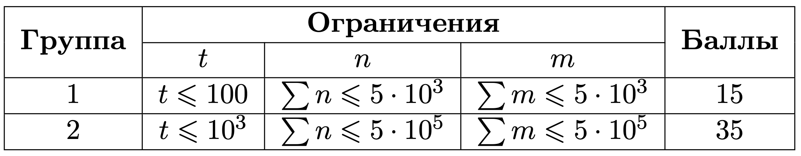

# Планировщик заказов

## Условие задачи

Имеется n заказов. Все заказы идентичны и занимают одинаковое пространство. Известно что 𝑖-й заказ прибудет в пункт сортировки ровно в момент времени 𝑎𝑟𝑟𝑖𝑣𝑎𝑙[𝑖]. Все 𝑎𝑟𝑟𝑖𝑣𝑎𝑙[𝑖] различны. Также есть 𝑚 грузовых машин. У каждой машины 𝑗 есть время начала погрузки товаров 𝑠𝑡𝑎𝑟𝑡[𝑗], время выезда с порта погрузки 𝑒𝑛𝑑[𝑗] и количество вмещаемых заказов 𝑐𝑎𝑝𝑎𝑐𝑖𝑡𝑦[𝑗].

Определите для каждого заказа 𝑖, в какую грузовую машину он попадёт.

Заказ попадает в машину, которая находится в пункте сортировки в момент прибытия заказа.

Если в один и тот же момент времени в пункте сортировки находится несколько машин, то заказ попадает в ту машину которая приехала раньше: 𝑠𝑡𝑎𝑟𝑡[𝑗] минимальный. Если же минимальный 𝑠𝑡𝑎𝑟𝑡 совпадает у нескольких машин то выбирается та, у которой индекс 𝑗 минимальный.

При этом в машине не может быть больше, чем 𝑐𝑎𝑝𝑎𝑐𝑖𝑡𝑦[𝑗] заказов. Следовательно, если машина загружена — заказ попадает в следующую машину, удовлетворяющую условиям выше.

## Входные данные

Каждый тест состоит из нескольких наборов входных данных.

Первая строка содержит целое число 𝑡 (1≤𝑡≤10^3) — количество наборов входных данных.

Далее следует описание наборов входных данных.

Первая строка содержит целое число 𝑛n (1≤𝑛≤5⋅10^5) — количество заказов.

Вторая строка каждого набора входных данных содержит 𝑛 целых чисел 𝑎𝑟𝑟𝑖𝑣𝑎𝑙 𝑖 (1≤𝑎𝑟𝑟𝑖𝑣𝑎𝑙 𝑖≤10^9), разделенных пробелом — массив 𝑎𝑟𝑟𝑖𝑣𝑎𝑙.

Третья строка содержит целое число 𝑚 (1≤𝑚≤5⋅10^5) — количество грузовых машин.

Далее следует m строк, каждая из которых содержит три целых числа 𝑠𝑡𝑎𝑟𝑡[𝑗], 𝑒𝑛𝑑[𝑗], 𝑐𝑎𝑝𝑎𝑐𝑖𝑡𝑦[𝑗] (1≤𝑠𝑡𝑎𝑟𝑡[𝑗]≤𝑒𝑛𝑑[𝑗]≤1𝑒9, 1≤𝑐𝑎𝑝𝑎𝑐𝑖𝑡𝑦[𝑗]≤𝑛) — время погрузки товаров, время выезда с порта погрузки и количество вмещаемых заказов для 𝑗 (1≤𝑗≤𝑚) машины.

Гарантируется, что сумма значений 𝑛 и 𝑚 по всем наборам входных данных не превышает 5⋅10^5.

## Выходные данные

Для каждого набора входных данных выведите одну строку.

Строка должна содержать ответ на задачу — для каждого заказа 𝑖i это номер машины, которая будет перевозить заказ.

Выведите −1, если:

- время прибытия заказа в пункт сортировки не попадает ни в один из временных интервалов, когда идёт загрузка в машины;
- во время доставки заказа в пункт сортировки все машины полностью загружены.



## Пример теста 1

### Входные данные

```
3
5
1 9 2 6 4
3
1 8 3
3 10 1
4 7 4
5
1 9 2 6 4
3
1 8 3
3 10 2
4 7 4
8
100 37 19 2 46 4 15 88
4
27 80 1
1 46 2
41 83 1
1 75 2

```

### Выходные данные

```
1 -1 1 2 1
1 2 1 2 1
-1 1 4 2 3 2 4 -1

```
