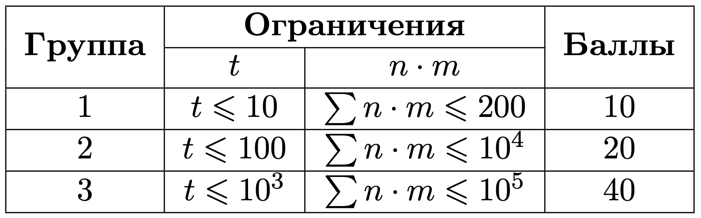
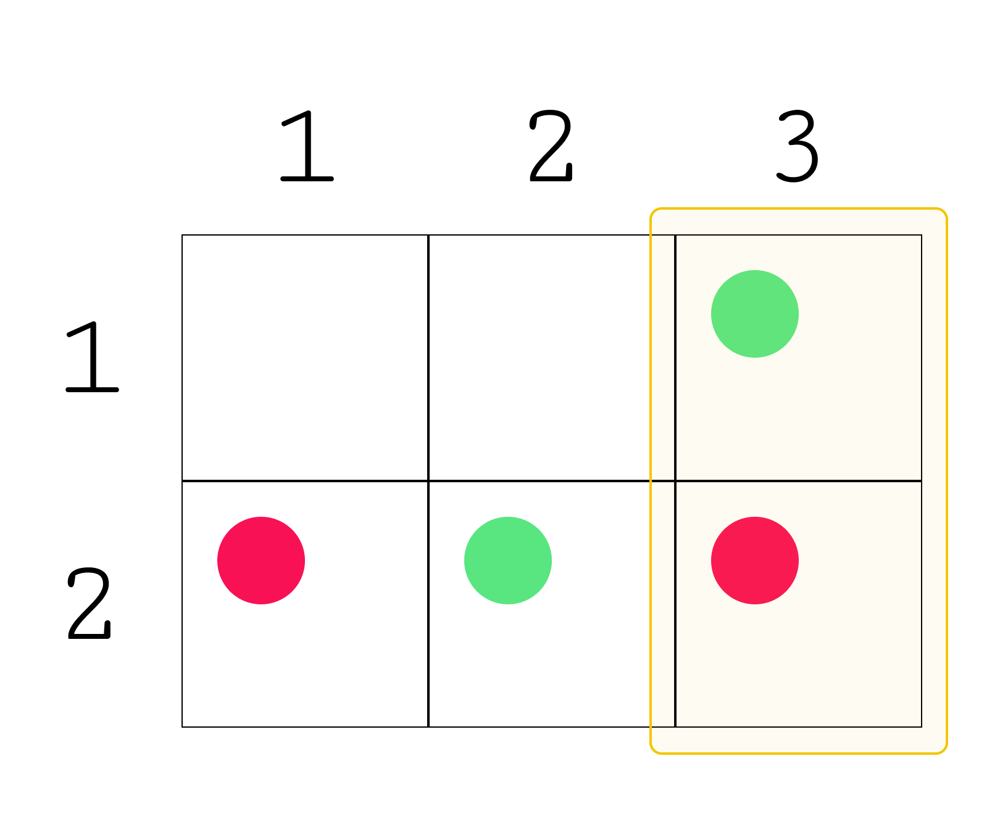
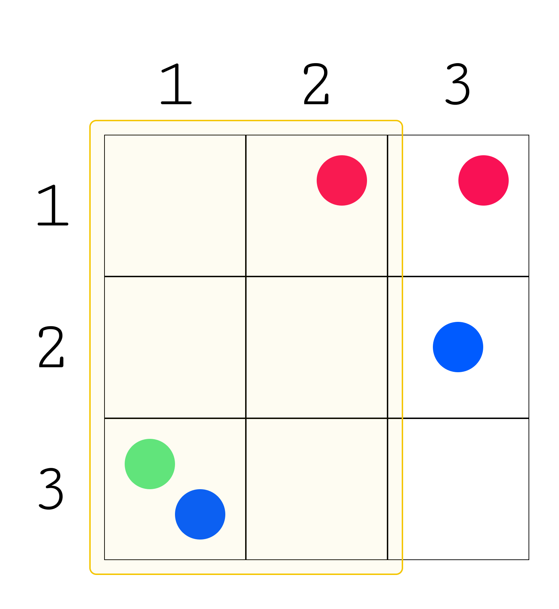

# Добыча природных ресурсов

## Условие задачи

Вы живете в городе прямоугольной формы с длиной 𝑛 и шириной 𝑚, в котором находятся 𝑘 различных видов природных ресурсов. Вам известны месторождения каждого ресурса в виде списка координат [𝑥,𝑦], где 𝑥 — позиция по длине города 𝑛, а 𝑦 — по ширине 𝑚.

Чтобы сократить объемы расходов на освоение ресурсов, найдите участок города:
- с минимально возможной площадью;
- прямоугольной формы со сторонами параллельными сторонам города;
- с хотя бы одним месторождением каждого ресурса.

## Входные данные

Каждый тест состоит из нескольких наборов входных данных.

Первая строка содержит целое число 𝑡 (1≤𝑡≤10^3) — количество наборов входных данных. Далее следует описание наборов входных данных.

Первая строка каждого набора входных данных содержит два целых числа 𝑛n и 𝑚m (1≤𝑛,𝑚≤10^5, 𝑛⋅𝑚≤10^5) — длина и ширина города.

Вторая строка каждого набора входных данных содержит целое число 𝑘 (2≤𝑘≤10) — количество видов природных ресурсов. Далее следует 𝑘 описаний месторождений ресурсов.

Первая строка каждого описания содержит целое число 𝑐𝑜𝑢𝑛𝑡 𝑖 (1≤𝑐𝑜𝑢𝑛𝑡 𝑖≤𝑛⋅𝑚) — количество месторождений 𝑖-го ресурса.

Следующие 𝑐𝑜𝑢𝑛𝑡𝑖 строк 𝑖-го описания содержат два целых числа 𝑥𝑗 и 𝑦𝑗 (1≤𝑥𝑗≤𝑛,1≤𝑦𝑗≤𝑚) — координаты 𝑗-го месторождения 𝑖-го ресурса.

Гарантируется, что сумма значений 𝑛⋅𝑚 по всем наборам входных данных не превышает 10^5.

## Выходные данные

Для каждого набора входных данных выведите одно целое число — минимальную площадь города, которая содержит все виды ресурсов.



Считаем, что ответ на задачу содержится в подматрице, ограниченной углами (𝑖1, 𝑗1) и (𝑖2, 𝑗2) включительно, где 𝑖1 и 𝑗1 — координаты верхнего левого угла, а 𝑖2 и 𝑗2 — координаты нижнего правого угла.

Тогда:
- для первого набора входных данных, ответ будет лежать между углами (1, 3) и (2, 3). На координате (1, 3) — лежит ресурс первого типа, на (2, 3) — второго типа.



- для второго набора, ответ будет лежать между углами (1, 1) и (3, 2). На координате (3, 1) — лежат ресурсы первого и третьего типа, на (1, 2) — ресурс второго типа.



Можно доказать, что для этих двух наборов входных данных нельзя найти ответ с меньшей площадью.

## Пример теста 1

### Входные данные

```
2
2 3
2
2
1 3
2 2
2
2 3
2 1
3 3
3
1
3 1
2
1 2
1 3
2
3 1
2 3

```

### Выходные данные

```
2
6

```
