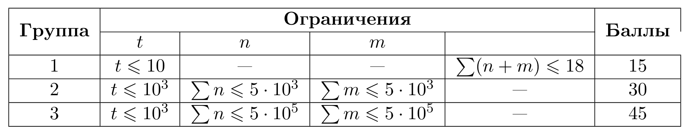

# Пункт выдачи заказов

## Условие задачи

В городе Донтвориэль есть 𝑛 пунктов выдачи заказов Озон, которым нужно безопасное интернет-подключение. Пункт выдачи заказа считается безопасно подключенным к интернету, если в нем установлен маршрутизатор или есть волоконное соединение (возможно проходящее через другие пункты) к другому пункту, который подключен к интернету. Безопасное волоконное соединение возможно только между определёнными парами пунктов выдачи заказов.

Установка маршрутизатора для каждого пункта 𝑖 стоит 𝑐𝑖 рублей, а стоимость волоконного соединения между пунктами 𝑢 и 𝑣 равна 𝑤 рублей.

Определите, в каких пунктах установить маршрутизаторы, а какие пункты соединить волокном, чтобы минимизировать общую стоимость и провести интернет во все пункты.

## Входные данные

Каждый тест состоит из нескольких наборов входных данных.

Первая строка содержит целое число 𝑡 (1≤𝑡≤10^3) — количество наборов входных данных.

Далее следует описание наборов входных данных.

Первая строка содержит целое число 𝑛 (2≤𝑛≤10^5) — количество пунктов выдачи заказов.

На второй строке расположены 𝑛n целых чисел 𝑐1,𝑐2,…,𝑐𝑛 — стоимость установки безопасного маршрутизатора для каждого пункта (1≤𝑐𝑖≤10^5).

Следующая строка содержит целое число 𝑚 (1≤𝑚≤𝑚𝑖𝑛(𝑛⋅(𝑛−1)/2,10^5)) — количество пар пунктов, в которых возможно волоконное соединение.

Затем следует 𝑚 строк, каждая из которых содержит три числа: 𝑢, 𝑣 и 𝑤. Где 𝑢 и 𝑣 (1≤𝑢<𝑣≤𝑛) — номера пунктов, а 𝑤 (1≤𝑤≤10^5) — стоимость построения безопасного волоконного соединения между пунктами 𝑢 и 𝑣.

## Выходные данные

Для каждого набора входных данных выведите одно целое число — минимальную стоимость для обеспечения интернет-подключения во всех пунктах.



В первом тесте есть достаточно много способов обеспечить интернет-подключением все пункты, давайте рассмотрим некоторые из них:

1. Можно поставить маршрутизаторы во все пункты, тогда мы заплатим 100 + 1 + 3 = 104.
2. Можно поставить маршрутизаторы во 2 и 3 пункт, а в 1 пункт провести оптоволокно из 3, тогда мы заплатим 1 + 3 + 1 = 5.
3. Можно поставить маршрутизатор во 2 пункт, в 1 провести оптоволокно из 2 пункта и в 3 из 2 пункта, тогда мы заплатим 1 + 1 + 5 = 7.
4. Самым выгодным же способом будет поставить маршрутизатор во 2 пункт, провести оптоволокно из 2 пункта в 1 пункт и из 1 пункта в 3 пункт, тогда суммарная стоимость составит 1 + 1 + 1 = 3.

Во втором тесте для обеспечения всех пунктов интернетом есть оптимальное решение — установить маршрутизатор в пунктах 2 и 4 (за стоимость 10+40=50) и проложить волоконные соединения: 1-2, 2-6, 3-4, 4-5 (за стоимость 20+15+25+5=65), в результате у всех пунктов есть безопасное интернет соединение. Общая стоимость 50+65= 115.

## Пример теста 1

### Входные данные

```
1
3
100 1 3
3
1 2 1
2 3 5
1 3 1

```

### Выходные данные

```
3

```

## Пример теста 2

### Входные данные

```
1
6
60 10 55 40 70 35
10
1 2 20
1 3 45
1 4 75
2 3 50
2 6 15
3 4 25
3 5 30
3 6 65
4 5 5
5 6 45

```

### Выходные данные

```
115

```
