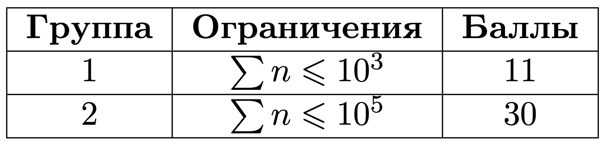

# Зеркальные пары

## Условие задачи

У Алисы есть массив $a$ из $n$ целых чисел. Из-за большой любви к зеркалам, Алиса хочет найти количество *зеркальных* пар чисел $(i, j)$. *Зеркальной* парой Алиса называет два числа $i$ и $j$ $(1 < i < j < n)$, где выполняется условие, что $a_i + a_j=a_{i-1}+a_{j+1}$. Помогите Алисе посчитать количество *зеркальных* пар чисел в массиве $a$. 


## Входные данные

Каждый тест состоит из нескольких наборов входных данных. 
 
Первая строка содержит целое число $t$ ($1 <= t <= 10^5$) — количество наборов входных данных. 
 
Далее следует описание наборов входных данных. 
 
В первой строке одного набора данных дано целое число $n$ $(4 <= n <= 10^5).$ 
 
Во второй строке дан массив $a$ из $n$ целых чисел $(1 <= a_i <= 10^9).$ 



## Выходные данные

Для каждого набора входных данных выведите количество *зеркальных* пар чисел.

*Зеркальные* пары для первого набора данных из примера: $(2, 3)$, $(2, 4)$, $(3, 4)$.

## Пример теста 1

### Входные данные

```
2 
5 
1 2 3 4 5 
4 
4 3 2 1 

```

### Выходные данные

```
3 
1 

```
