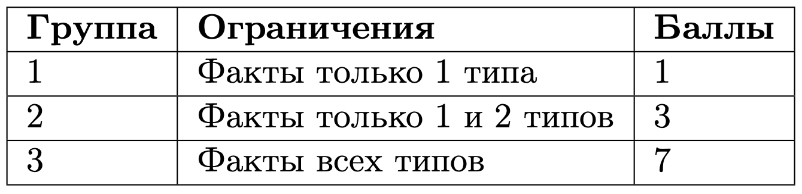

# Возраст

## Условие задачи

Ночью вам снился сон о том, как вы с друзьями отмечали свой день рождения. Вы здорово провели время, а когда все разошлись, вдруг задумались о том, сколько же лет одному из друзей. Подумав, вы смогли вспомнить 3 факта.

Вопрос, который вы задали себе, выглядит следующим образом:

• $\texttt{«How old is } A_i \texttt{?»}$ — Cколько лет другу по имени $A_i$?

Факты могут быть следующих типов:

1. $\texttt{«} A_j \texttt{ is X years old»}$ — возраст друга по имени $A_j$ составляет $X$ лет.
2. $\texttt{«} A_j \texttt{ is the same age as } A_k \texttt{»}$ — другу по имени $A_j$ столько же лет, сколько другу по имени $A_k$.
3. $\texttt{«} A_j \texttt{ is X years younger than } A_k \texttt{»}$ — друг по имени $A_j$ младше друга по имени $A_k$ на $X$ лет.
4. $\texttt{«} A_j \texttt{ is X years older than } A_k\texttt{»}$ — друг по имени $A_j$ старше друга по имени $A_k$ на $X$ лет.

Найдите ответ на заданный вопрос.

Обратите внимание, действие происходит во сне. В нём, как известно, допустимы многие странные вещи, например, возраст друзей может быть отрицательным.

## Входные данные

Первая строка содержит натуральное число $t$ $(1 \leq t \leq 10^3)$ — количество наборов входных данных.

Далее следуют сами наборы данных:

• первая строка содержит вопрос в формате, описанном в условии задачи;

• далее идут 3 строки, по одному факту на строку в формате, описанном в условии задачи.

Имена могут состоять из одной заглавной латинской буквы или нескольких латинских букв, первая из которых — заглавная, остальные — строчные. Длина имён не более 16 символов.

Возрасты и разницы в возрастах ваших друзей в известных вам фактах находятся в диапазоне [0; 100].

Гарантируется, что в рамках одного набора данных:

• факты не противоречат друг другу;

• фактов достаточно для получения однозначного ответа на заданный вопрос.

### Группы тестов



Обратите внимание, примеры из условия могут не совпадать с первыми тестами в системе и архиве.

## Выходные данные

Выведите $t$ строк, где $i$-я строка должна содержать ответ на вопрос из $i$-го набора данных. Ответ должен представлять собой целое число — количество лет.

## Пример теста 1

### Входные данные

```
3
How old is A?
B is 2 years younger than Caac
A is 44 years older than B
B is 55 years old
How old is B?
A is 2 years older than Ca
B is 10 years younger than Ca
A is 2 years old
How old is Bd?
C is 23 years younger than Bd
C is 38 years younger than A
Bd is 27 years old

```

### Выходные данные

```
99
-10
27

```

## Пример теста 2

### Входные данные

```
1
How old is I?
I is 2 years old
You is 3 years old
We is 4 years old

```

### Выходные данные

```
2

```

## Пример теста 3

### Входные данные

```
1
How old is I?
We is 40 years old
You is the same age as We
I is the same age as You

```

### Выходные данные

```
40

```