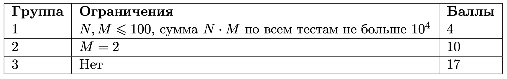
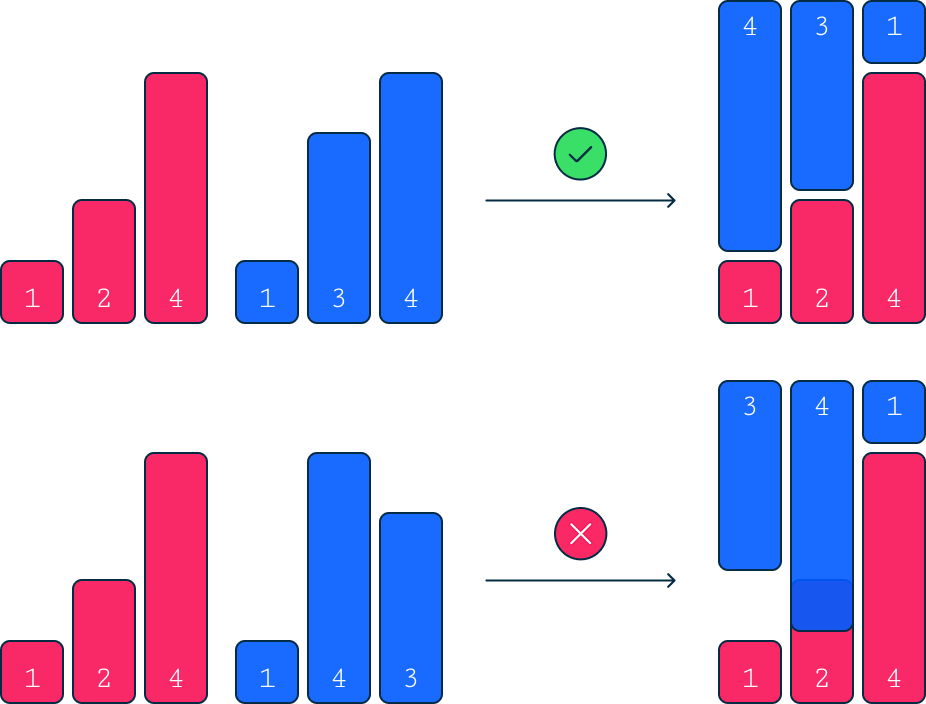

# Гистограммы

## Условие задачи

Гистограммой является массив, каждый элемент которого указывает высоту столбика на соответствующей позиции.
Две гистограммы считаются совпадающими, если при совмещении одной гистограммы с другой гистограммой, повёрнутой на угол 180°, получается ровный прямоугольник без наложений и пропусков. Более формально: две гистограммы $a$ и $b$ называются совпадающими, если $a_i+b_{m-i+1}=a_j+b_{m-j+1}$ для любой пары $(i, j)$ $(1 \le i,j \le m)$.

Даны $N$ гистограмм длины $M$, необходимо найти количество пар совпадающих гистрограмм.

## Входные данные

Каждый тест состоит из нескольких наборов входных данных.

Первая строка содержит целое число $t$ $(1 \le t \le 10^5)$ — количество наборов входных данных.

В первой строке каждого набора входных данных даны числа $N$ и $M$. $N$ обозначает количество различных гистограмм, $M$ — их длину $(2 \le N, M \le 10^5).$ Гарантируется, что сумма $N \cdot M$ по всем тестам не больше $10^5$.

Каждая из следующих $N$ строк содержит $M$ целых неотрицательных чисел. Все числа не превосходят $10^9$.

### Группы тестов



## Выходные данные

Для каждого набора входных данных выведите число — количество пар совпадающих гистограмм.

### Иллюстрация

На картинке пример пар совпадающих и несовпадающих гистограмм:


## Пример теста 1

### Входные данные

```
3
3 3
1 2 4
1 3 4
1 4 3
3 4
1 3 2 4
1 3 2 4
2 4 3 5
2 2
1 2
2 1

```

### Выходные данные

```
1
3
0

```