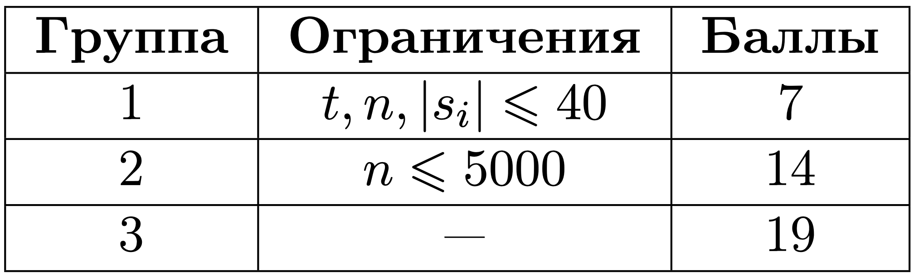

# Похожие строки

## Условие задачи

Маркетологам компании «Ozion» поступило задание — придумать уникальный слоган для новой рекламной компании.

У компании очень большая и креативная команда, поэтому слоган решили собирать из слов. Для этого каждый сотрудник должен предложить какое-то слово для слогана.

Вы работает программистом в компании «Ozion» и хотите помочь. Маркетологам интересно, как много похожих слов они вам прислали.

Вам дается число $t$ — общее количество наборов со строками.
  
Каждый набор содержит $N$ строк. Назовём 2 строки похожими, если у них совпадают все буквы на чётных позициях или все буквы на нечётных.

Ваша задача — помочь креативным маркетологам найти количество пар похожих строк.

## Входные данные

Каждый тест состоит из нескольких наборов входных данных.

Первая строка каждого набора входных данных содержит целое число $t$ — количество тестовых наборов, $(1 \le t \le 100)$.

Вторая строка каждого набора входных данных содержит целое число число $n$ — количество строк, $(1 \le n \le 10^6)$.

Следующие $n$ строк каждого набора входных данных содержат множество строк $s_i$ $(1 \le |s_i| \le 10^6)$. Строки состоят из строчных латинских букв.

Гарантируется, что сумма $n$ по всем наборам входных данных не больше $10^6$. Гарантируется, что сумма длин всех строк по всем наборам входных данных не больше $10^6$.


## Выходные данные

Для каждого набора входных данных выведите количество пар похожих строк.

Похожие пары: $abcde$ и $adcbe$, $abcde$ и $xbxde$.

## Пример теста 1

### Входные данные

```bash
7
3
ababa
ababa
ababa
3
asd
das
sda
2
abca
abc
4
aaaa
aaaa
aaaa
aaa
2
aa
aa
2
a
a
2
a
b

```

### Выходные данные

```bash
3
0
1
6
1
1
0

```
