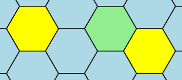
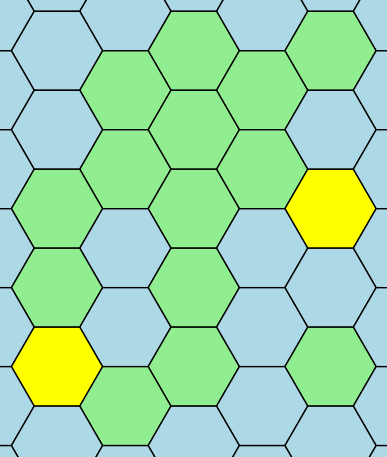
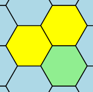

# Путь по суше

## Условие задачи

В Nozo разрабатывается новая компьютерная игра — «Колонизация 8». Вам поручено реализовать поиск пути для сухопутных юнитов.

Поле игры состоит из шестиугольников, которыми можно полностью покрыть бесконечную плоскость. Все шестиугольники на поле игры делятся на 2 типа — суша и море. Каждый шестиугольник, $\textit{у которого есть 6 сторон}$, считается сушей. Остальные шестиугольники — морем.

Вам дана таблица из символов, состоящая из $n$ строк. Каждая строка содержит $m$ символов. Границы шестиугольников обозначаются символами «\» — обратный слеш, «/» — прямой слеш и «_» — нижнее подчёркивание. Остальные символы поля — пробелы.

Все шестиугольники на поле имеют одинаковый размер. Обозначим за ширину шестиугольника количество подряд идущих символов «_» в его верхней и нижней сторонах. Аналогично назовём высотой шестиугольника количество символов «/» в левой верхней и правой нижней сторонах.


Определите, есть ли путь между двумя шестиугольниками суши, который проходит только по шестиугольникам суши. Из одного шестиугольника суши можно перейти в любой из шести соседних шестиугольников суши. Шестиугольники называются соседними, если имеют общую границу.

## Входные данные

Каждый тест состоит из нескольких наборов входных данных.

Первая строка каждого теста содержит целое число $t$ ($1 \le t \le 100$) — количество наборов входных данных.

Далее следует описание наборов входных данных.

Первая строка каждого набора входных данных содержит два целых числа $n$ и $m$ ($3 \le n, m \le 100$) — количество строк и столбцов, из которых состоит поле.

Следующие $n$ строк каждого набора входных данных содержат по $m$ символов — поле с шестиугольниками.

Следующие две строки каждого набора входных данных содержат по два целых числа $x, y$ ($1 \le x \le n$, $1 \le y \le m$) — координаты точки: номер строки и номер столбца.

Гарантируется:

• Обе координаты принадлежат к некоторым шестиуголькам суши, возможно — к одному и тому же.

• Данная координата не является границей никаких шестиугольников, то есть символ на данной координате — пробел.

• В первой и последней строках,  а также в первом и последнем столбцах есть хотя бы один непробельный символ. Следовательно, в этом поле есть хотя бы один шестиугольник суши.

• В этой таблице символов некоторые пробелы можно заменить на символы «_», «/», «\» так, чтобы получилась регулярная сетка из шестиугольников одинакового размера.

Высота и ширина каждого шестиугольника не больше 10.

### Система оценки

| Группа | Ограничения | Баллы |
|--------|-------------|-------|
| 1 | Ширина и высота шестиугольников равна 1 | 10 |
| 2 | Без дополнительных ограничений | 25 |

## Выходные данные

Для каждого набора входных данных выведите $\texttt{YES}$, если между двумя шестиугольниками есть путь, который проходит только по шестиугольникам суши, иначе выведите $\texttt{NO}$.

### Иллюстрации

Ниже изображены входные данные для первого теста из условия.








## Пример теста 1

### Входные данные

```
4
3 3
 _ 
/ \
\_/
2 2
2 2
4 9
 _   _   
/ \ / \_ 
\_/ \_/ \
      \_/
2 2
3 8
12 11
     _   _ 
   _/ \_/ \
  / \_/ \_/
  \_/ \_/  
 _/ \_/ \_ 
/ \_/ \_/ \
\_/ \_/ \_/
/ \ / \    
\_/ \_/  _ 
/ \_/ \ / \
\_/ \_/ \_/
  \_/      
10 2
6 10
5 5
   _ 
 _/ \
/ \_/
\_/ \
  \_/
2 4
3 2

```

### Выходные данные

```
YES
NO
YES
YES

```

## Пример теста 2

### Входные данные

```
3
5 5
  _  
 / \ 
/   \
\   /
 \_/ 
2 3
4 4
6 7
 __    
/  \__ 
\__/  \
/  \__/
\__/  \
   \__/
2 3
5 5
12 16
 ____      ____ 
/    \____/    \
\____/    \____/
     \____/     
 ____      ____ 
/    \    /    \
\____/    \____/
                
 ____           
/    \____      
\____/    \     
     \____/     
6 14
10 4

```

### Выходные данные

```
YES
YES
NO

```