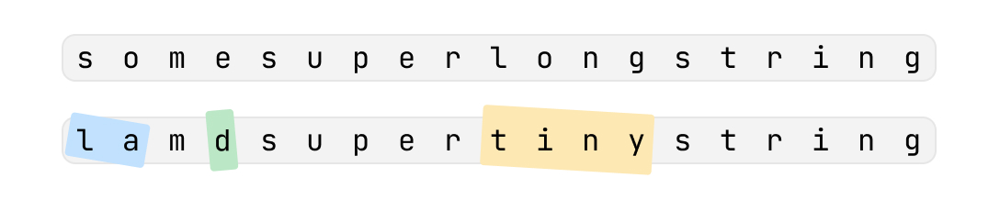
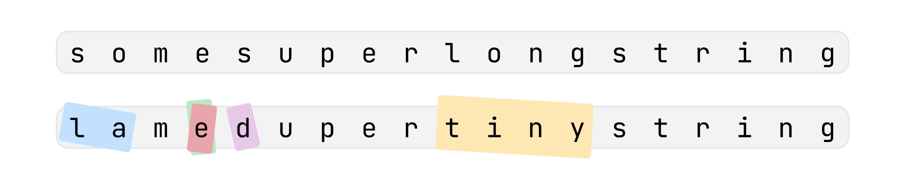

# Наклейки

## Условие задачи

Для отслеживания посылок компания NOZO использует наклейки с надписями. Иногда надпись (или её часть) на наклейке нужно исправить, и тогда поверх старой наклейки лепят новую.

На очередной посылке появилось слишком много наклеек и теперь невозможно прочитать наклеенную надпись целиком.

Помогите это сделать по истории этих наклеек.

## Входные данные

Первая строка 𝑠 представляет собой содержимое изначальной наклейки. Гарантируется, что её длина не превышает 1000 символов.

Во второй строке записано целое число 𝑛n (1≤𝑛≤1000), обозначающее количество наклеенных поверх наклеек.

Далее идёт 𝑛 строк, каждая из которых описывает очередную наклейку в порядке её применения: от самой старой к самой новой. Каждое описание содержит два числа 𝑠𝑡𝑎𝑟𝑡𝑖 и 𝑒𝑛𝑑𝑖 (1≤𝑠𝑡𝑎𝑟𝑡≤𝑒𝑛𝑑≤∣𝑠∣, где ∣𝑠∣ обозначает длину строки 𝑠) и через пробел строку 𝑟𝑖, которая была записана поверх символов между 𝑠𝑡𝑎𝑟𝑡𝑖 и 𝑒𝑛𝑑𝑖.

Гарантируется, что длина строки 𝑟𝑖 точно равна 𝑒𝑛𝑑−𝑠𝑡𝑎𝑟𝑡+1. Эта запись обозначает, что поверх всех символов, начиная с символа под номером 𝑠𝑡𝑎𝑟𝑡 заканчивая символом под номером 𝑒𝑛𝑑, была наклеена строка 𝑟𝑖.

Гарантируется, что все строки состоят только из строчных латинских букв.

## Выходные данные

Выведите итоговую строку, которая видна после применения всех наклеек.

Иллюстрация к первому примеру из условия:



Пояснение к первому примеру:

- Наклеивается первая наклейка и строка становится lamesuperlongstring.
- Наклеивается вторая наклейка и строка становится lamdsuperlongstring.
- Наклеивается третья наклейка и строка становится lamdsupertinystring.

Иллюстрация ко второму примеру из условия:



Пояснение ко второму примеру:

- Наклеивается первая наклейка и строка становится lamesuperlongstring.
- Наклеивается вторая наклейка и строка становится lamdsuperlongstring.
- Наклеивается третья наклейка и строка становится lamdsupertinystring.
- Наклеивается четвертая наклейка и строка становится lamedupertinystring.

## Пример теста 1

### Входные данные

```
somesuperlongstring
3
1 2 la
4 4 d
10 13 tiny

```

### Выходные данные

```
lamdsupertinystring

```

## Пример теста 2

### Входные данные

```
somesuperlongstring
4
1 2 la
4 4 d
10 13 tiny
4 5 ed

```

### Выходные данные

```
lamedupertinystring

```
