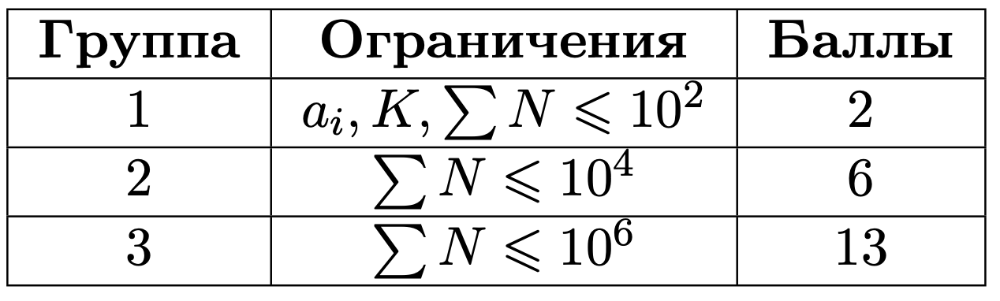

# K-уменьшение

## Условие задачи

Дан массив $a$ длины $N$.

Назовём подмассивом $[l, r]$ отрезок подряд идущих элементов $[a\_l, \dots, a\_i, \dots, a\_r]$.

Выполняется операция: выбирается подмассив длины $K$, каждый элемент которого является положительным числом, и из элемента подмассива вычитается по единице. Нужно ответить, можно ли повторением такой операции обнулить все элементы массива.

## Входные данные

Каждый тест состоит из нескольких наборов входных данных.

Первая строка содержит целое число $t$ ($1 \le t \le 10^6$) — количество наборов входных данных.

Далее следуют описания наборов входных данных.

Первая строка каждого набора входных данных состоит из двух целых чисел $N$ и $K$ $(1 \le K \le N$,  $1 \le N \le 10^6).$

Гарантируется, что сумма $N$ по всем тестам меньше $10^6$.

Во второй строке дан массив $a$ из $N$ целых чисел ($0 \le a_i \le 10^9$).

$\large Группы \:тестов$


## Выходные данные

Для каждого теста выведите $\texttt{YES}$, если возможно обнулить все элементы описанными операциями, и $\texttt{NO}$ — в обратном случае.

$\large Пояснение \:к \:примерам$
В первом тесте преобразование массива можно представить так:
[1, 2, 3, 2] $\rightarrow$ [0, 1, 3, 2] $\rightarrow$ [0, 0, 2, 2] $\rightarrow$ [0, 0, 1, 1] $\rightarrow$ [0, 0, 0, 0]. То есть все элементы массива обнулились.

А во втором тесте — [1, 3, 1] $\rightarrow$ [0, 2, 1] $\rightarrow$ [0, 1, 0], второй элемент массива обнулить не получилось.

## Пример теста 1

### Входные данные

```
1
4 2
1 2 3 2

```

### Выходные данные

```
YES

```

## Пример теста 2

### Входные данные

```
1
3 2
1 3 1

```

### Выходные данные

```
NO

```