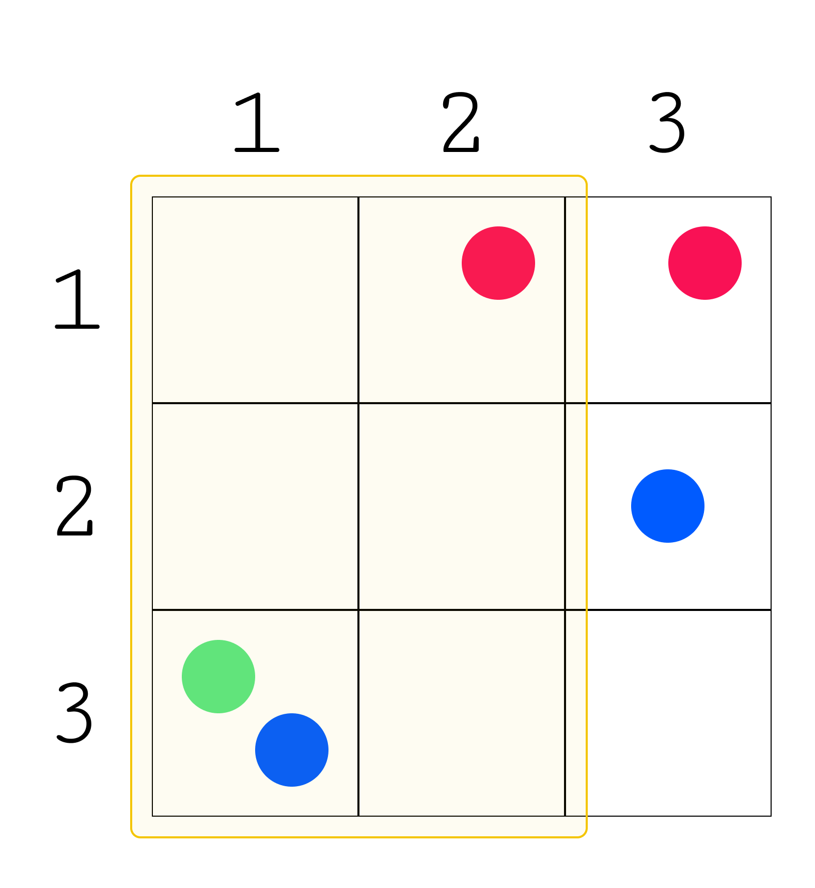

# Добыча природных ресурсов

## Условие задачи

Вы живете в городе прямоугольной формы с длиной $n$ и шириной $m$, в котором находятся $k$ различных видов природных ресурсов. Вам известны месторождения каждого ресурса в виде списка координат $[x, y]$, где $x$ — позиция по длине города $n$, а $y$ — по ширине $m$.

Чтобы сократить объемы расходов на освоение ресурсов, найдите участок города:

- с минимально возможной площадью;
- прямоугольной формы со сторонами параллельными сторонам города;
- с хотя бы одним месторождением каждого ресурса.

## Входные данные

Каждый тест состоит из нескольких наборов входных данных.

Первая строка содержит целое число $t$ $(1 <= t <= 10^3)$ — количество наборов входных данных. Далее следует описание наборов входных данных.

Первая строка каждого набора входных данных содержит два целых числа $n$ и $m$ $(1 <= n, m <= 10^5$, $n *m <= 10^5)$ — длина и ширина города.

Вторая строка каждого набора входных данных содержит целое число $k$ $(2 <= k <= 10)$ — количество видов природных ресурсов. Далее следует $k$ описаний месторождений ресурсов.

Первая строка каждого описания содержит целое число $count_i$ $(1 <= count_i <= n*m)$ — количество месторождений $i$-го ресурса.

Следующие $count_i$ строк $i$-го описания содержат два целых числа $x_j$ и $y_j$ $(1 <= x_j <= n, 1 <= y_j <= m)$ — координаты $j$-го месторождения $i$-го ресурса.

Гарантируется, что сумма значений $n*m$ по всем наборам входных данных не превышает $10^5$.


## Выходные данные

Для каждого набора входных данных выведите одно целое число — минимальную площадь города, которая содержит все виды ресурсов.

Считаем, что ответ на задачу содержится в подматрице, ограниченной углами ($i1$, $j1$) и ($i2$, $j2$) включительно, где $i1$ и $j1$ — координаты верхнего левого угла, а $i2$ и $j2$ — координаты нижнего правого угла.

Тогда:

- для первого набора входных данных, ответ будет лежать между углами (1, 3) и (2, 3). На координате (1, 3) — лежит ресурс первого типа, на (2, 3) — второго типа.


- для второго набора, ответ будет лежать между углами (1, 1) и (3, 2). На координате (3, 1) — лежат ресурсы первого и третьего типа, на (1, 2) — ресурс второго типа.



Можно доказать, что для этих двух наборов входных данных нельзя найти ответ с меньшей площадью.

## Пример теста 1

### Входные данные

```
2
2 3
2
2
1 3
2 2
2
2 3
2 1
3 3
3
1
3 1
2
1 2
1 3
2
3 1
2 3

```

### Выходные данные

```
2
6

```
