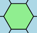
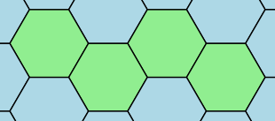
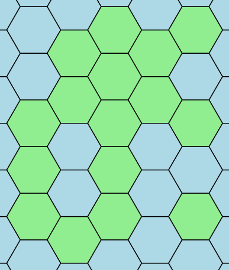
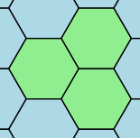

# Символы моря

## Условие задачи

В Nozo разрабатывается новая компьютерная игра — «Колонизация 8». Вам поручено реализовать генератор игровых карт.

Поле игры состоит из шестиугольников, которыми можно полностью покрыть бесконечную плоскость. Все шестиугольники на поле игры делятся на 2 типа — суша и море. Каждый шестиугольник, $\textit{у которого есть 6 сторон}$, считается сушей. Остальные шестиугольники — морем.

Вам дана таблица из символов, состоящая из $n$ строк. Каждая строка содержит $m$ символов. Границы шестиугольников обозначаются символами $\texttt{«\textbackslash»}$ — обратный слеш, $\texttt{«/»}$ — прямой слеш и $\texttt{«\_»}$ — нижнее подчёркивание. Остальные символы поля — пробелы.

Все шестиугольники на поле имеют одинаковый размер. Обозначим за ширину шестиугольника количество подряд идущих символов $\texttt{«\_»}$ в его верхней и нижней сторонах. Аналогично назовём высотой шестиугольника количество символов $\texttt{«/»}$ в левой верхней и правой нижней сторонах.


Замените на символы тильды «~» все пробелы, которые:

• относятся к шестиугольникам моря;

• находятся на границах поля, т.е. на неполных шестиугольниках.

## Входные данные

Каждый тест состоит из нескольких наборов входных данных.

Первая строка каждого теста содержит целое число $t$ ($1 \le t \le 100$) — количество наборов входных данных.

Далее следует описание наборов входных данных.

Первая строка каждого набора входных данных содержит два целых числа $n$ и $m$ ($3 \le n, m \le 100$) — количество строк и столбцов, из которых состоит поле.

Следующие $n$ строк каждого набора входных данных содержат по $m$ символов — поле с шестиугольниками.

Гарантируется:

• В первой и последней строках, а также в первом и последнем столбцах есть хотя бы один непробельный символ. Следовательно, в этом поле есть хотя бы один шестиугольник суши.

• В этой таблице символов некоторые пробелы можно заменить на символы $\texttt{«\_»}$, $\texttt{«/»}$, $\texttt{«\textbackslash»}$ так, чтобы получилась регулярная сетка из шестиугольников одинакового размера.

Высота и ширина каждого шестиугольника не больше 10.

$\large Система \:оценки$
$$\begin{array}{|c|c|c|}
\hline
\bold{Группа} & \bold{Ограничения}            & \bold{Баллы} \\ \hline
1               & Ширина\: и\: высота \:шестиугольников\: равна \:1 & 6              \\ \hline
2               & Без\:дополнительных\:ограничений  & 18             \\ \hline
\end{array}$$

## Выходные данные

Для каждого набора входных данных выведите поле, в котором символы, гарантировано не относящиеся ни к какому из шестиугольников, заменены на символ «~». После вывода ответа на каждый набор входных данных выведите пустую строку.

$\large Иллюстрации$
Ниже изображены входные данные для первого теста из условия.









## Пример теста 1

### Входные данные

```
4
3 3
 _ 
/ \
\_/
4 9
 _   _   
/ \_/ \_ 
\_/ \_/ \
  \_/ \_/
12 11
     _   _ 
   _/ \_/ \
  / \_/ \_/
  \_/ \_/  
 _/ \_/ \_ 
/ \_/ \_/ \
\_/ \_/ \_/
/ \ / \    
\_/ \_/  _ 
/ \_/ \ / \
\_/ \_/ \_/
  \_/      
5 5
   _ 
 _/ \
/ \_/
\_/ \
  \_/

```

### Выходные данные

```
~_~
/ \
\_/

~_~~~_~~~
/ \_/ \_~
\_/ \_/ \
~~\_/~\_/

~~~~~_~~~_~
~~~_/ \_/ \
~~/ \_/ \_/
~~\_/ \_/~~
~_/ \_/ \_~
/ \_/ \_/ \
\_/~\_/~\_/
/ \~/ \~~~~
\_/~\_/~~_~
/ \_/ \~/ \
\_/ \_/~\_/
~~\_/~~~~~~

~~~_~
~_/ \
/ \_/
\_/ \
~~\_/


```

## Пример теста 2

### Входные данные

```
3
5 5
  _  
 / \ 
/   \
\   /
 \_/ 
6 7
 __    
/  \__ 
\__/  \
/  \__/
\__/  \
   \__/
12 16
 ____      ____ 
/    \____/    \
\____/    \____/
     \____/     
 ____      ____ 
/    \    /    \
\____/    \____/
                
 ____           
/    \____      
\____/    \     
     \____/     

```

### Выходные данные

```
~~_~~
~/ \~
/   \
\   /
~\_/~

~__~~~~
/  \__~
\__/  \
/  \__/
\__/  \
~~~\__/

~____~~~~~~____~
/    \____/    \
\____/    \____/
~~~~~\____/~~~~~
~____~~~~~~____~
/    \~~~~/    \
\____/~~~~\____/
~~~~~~~~~~~~~~~~
~____~~~~~~~~~~~
/    \____~~~~~~
\____/    \~~~~~
~~~~~\____/~~~~~


```