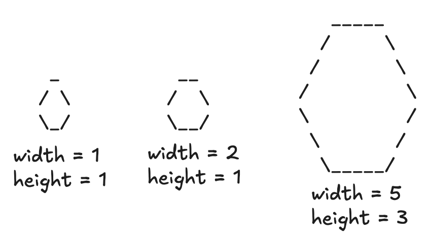
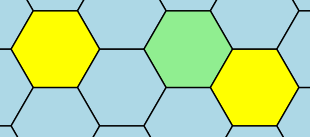
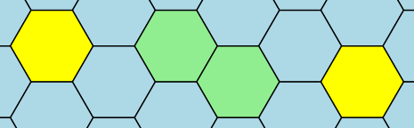
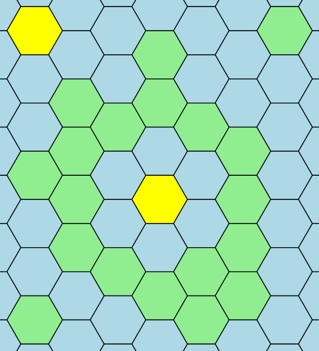

# Путь с пересадками

## Условие задачи

В Nozo разрабатывается новая компьютерная игра — «Колонизация 8». Вам поручено реализовать поиск пути для универсальных юнитов.

Поле игры состоит из шестиугольников, которыми можно полностью покрыть бесконечную плоскость. Все шестиугольники на поле игры делятся на 2 типа — суша и море. Каждый шестиугольник, $\textit{у которого есть 6 сторон}$, считается сушей. Остальные шестиугольники — морем.

Вам дана таблица из символов, состоящая из $n$ строк. Каждая строка содержит $m$ символов. Границы шестиугольников обозначаются символами $\texttt{«\textbackslash»}$ — обратный слеш, $\texttt{«/»}$ — прямой слеш и $\texttt{«\_»}$ — нижнее подчёркивание. Остальные символы поля — пробелы.

Все шестиугольники на поле имеют одинаковый размер. Обозначим за ширину шестиугольника количество подряд идущих символов $\texttt{«\_»}$ в его верхней и нижней сторонах. Аналогично назовём высотой шестиугольника количество символов $\texttt{«/»}$ в левой верхней и правой нижней сторонах.



Вам даны два шестиугольника суши. Определите минимальное количество раз, которое вам придётся переместиться из шестиугольника суши в шестиугольник моря и наоборот на пути между двумя данными шестиугольниками. Количество перемещений между шестиугольниками одного типа не имеет значения. Например, между двумя шестиугольниками суши. Из одного шестиугольника можно перейти в любой из шести соседних шестиугольников.

Шестиугольники называются соседними, если имеют общую границу. Карта для игры бесконечная, и юниты могут выходить за границы поля. Все шестиугольники, входящие в таблицу символов частично или не входящие совсем, являются шестиугольниками моря.

## Входные данные

Каждый тест состоит из нескольких наборов входных данных.

Первая строка каждого теста содержит целое число $t$ ($1 \le t \le 100$) — количество наборов входных данных.

Далее следует описание наборов входных данных.

Первая строка каждого набора входных данных содержит два целых числа $n$ и $m$ ($3 \le n, m \le 100$) — количество строк и столбцов, из которых состоит поле.

Следующие $n$ строк каждого набора входных данных содержат по $m$ символов — поле с шестиугольниками.

Следующие две строки каждого набора входных данных содержат по два целых числа $x, y$ ($1 \le x \le n$, $1 \le y \le m$) — координаты точки: номер строки и номер столбца.

Гарантируется:
• Обе координаты принадлежат к некоторым шестиуголькам суши, возможно — к одному и тому же.
• Данная координата не является границей никаких шестиугольников, то есть символ на данной координате — пробел.
• В первой и последней строках,  а также в первом и последнем столбцах есть хотя бы один непробельный символ. Следовательно, в этом поле есть хотя бы один шестиугольник суши.
• В этой таблице символов некоторые пробелы можно заменить на символы $\texttt{«\_»}$, $\texttt{«/»}$, $\texttt{«\textbackslash»}$ так, чтобы получилась регулярная сетка из шестиугольников одинакового размера.

Высота и ширина каждого шестиугольника не больше 10.

$\large Система \:оценки$
$$\begin{array}{|c|c|c|}
\hline
\bold{Группа} & \bold{Ограничения}            & \bold{Баллы} \\ \hline
1               & Ширина\: и\: высота \:шестиугольников\: равна \:1 & 13              \\ \hline
2               & Без\:дополнительных\:ограничений  & 28             \\ \hline
\end{array}$$

## Выходные данные

Для каждого набора входных данных выведите минимальное количество раз, которое вам придётся переместиться из шестиугольника суши в шестиугольник моря и наоборот на пути между двумя данными шестиугольниками.

$\large Иллюстрации$








## Пример теста 1

### Входные данные

```
4
3 3
 _ 
/ \
\_/
2 2
2 2
4 9
 _   _   
/ \ / \_ 
\_/ \_/ \
      \_/
2 2
3 8
4 13
 _   _       
/ \ / \_   _ 
\_/ \_/ \ / \
      \_/ \_/
2 2
3 12
15 15
 _           _ 
/ \    _    / \
\_/   / \   \_/
   _  \_/      
  / \_/ \_     
  \_/ \_/ \_   
 _/ \_/ \_/ \  
/ \_/  _  \_/  
\_/ \ / \ / \  
  \_/ \_/ \_/  
  / \_   _/ \  
  \_/ \_/ \_/  
 _  \_/ \_/ \  
/ \   \_/ \_/  
\_/     \_/    
2 2
9 8

```

### Выходные данные

```
0
2
2
4

```

## Пример теста 2

### Входные данные

```
3
5 5
  _  
 / \ 
/   \
\   /
 \_/ 
2 3
4 4
6 7
 __    
/  \__ 
\__/  \
/  \__/
\__/  \
   \__/
2 3
5 5
12 16
 ____      ____ 
/    \____/    \
\____/    \____/
     \____/     
 ____      ____ 
/    \    /    \
\____/    \____/
                
 ____           
/    \____      
\____/    \     
     \____/     
6 14
10 4

```

### Выходные данные

```
0
0
2

```