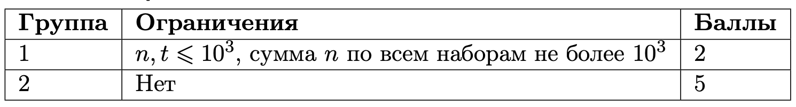

# Кто мяукает?!

## Условие задачи

Чем дольше Иван слышал этот звук, тем больше сходил с ума! В отчаянии он решил отложить все свои дела, чтобы наконец вычислить, кто из окружающих его коллег исподтишка выполняет это действие.

Для этого Иван подошёл к каждому из коллег и попросил высказать своё мнение о сложившейся ситуации. Ответы коллег он записал в одном из следующих форматов:

1. $\texttt{«A: I am x!»}$ — подозреваемый по имени $\textit{A}$ утверждает, что выполняет действие $\textit{x}$.
2. $\texttt{«A: I am not x!»}$ — подозреваемый по имени $\textit{A}$ утверждает, что не выполняет действие $\textit{x}$.
3. $\texttt{«A: B is x!»}$ — подозреваемый по имени $\textit{A}$ считает, что подозреваемый $\textit{B}$ выполняет действие $\textit{x}$.
4. $\texttt{«A: B is not x!»}$ — подозреваемый по имени $\textit{A}$ считает, что подозреваемый $\textit{B}$ не выполняет действие $\textit{x}$.

Каждый из подозреваемых дал не более одного высказывания по каждому подозреваемому, включая себя. Если подозреваемый говорил про себя, Иван точно записал его ответ в формате $\texttt{«A: I am x!»}$ или $\texttt{«A: I am not x!»}$. Также Иван уверен, что не существует подозреваемых, которые не фигурируют в его записях: то есть тех, кто ничего не говорил сам, и про кого ничего не говорили другие.

Теперь, имея набор записей, Иван решил подсчитать очки каждого подозреваемого по следующему алгоритму:

• изначально у каждого подозреваемого $0$ очков;
• каждое высказывание $\texttt{«A: I am x!»}$ прибавляет подозреваемому $\textit{A}$ два очка;
• каждое высказывание $\texttt{«A: I am not x!»}$ отнимает у подозреваемого $\textit{A}$ одно очко;
• каждое высказывание $\texttt{«A: B is x!»}$ прибавляет подозреваемому $\textit{B}$ одно очко;
• каждое высказывание $\texttt{«A: B is not x!»}$ отнимает у подозреваемого $\textit{B}$ одно очко.

В итоге Иван считает, что выполняют действие те люди, кто суммарно набрал наибольшее количество очков в сумме по всем высказываниям. Количество очков может быть и отрицательным. Помогите Ивану рассчитать, кто выполняет это действие.

## Входные данные

Первая строка входных данных содержит натуральное число $t$ $(1 \leq t \leq 10^5)$ — количество наборов входных данных. Следующие строки содержат подряд идущие наборы входных данных. Рассмотрим очередной такой набор.

Первая строка набора входных данных содержит натуральное число $n$ $(1 \leq n \leq 10^5)$ — количество высказываний. Далее идёт $n$ строк в формате, описанном в условии задачи, где $\texttt{A}$ и $\texttt{B}$ обозначают имена подозреваемых, а $\texttt{x}$ — какое-то действие.

Гарантируется, что:
• $\texttt{A}$, $\texttt{B}$ и $\texttt{x}$ состоят только из букв английского алфавита и не длиннее $10$ символов. При этом $\texttt{x}$ содержит только строчные буквы. $\texttt{A}$ и $\texttt{B}$ же начинаются с заглавной буквы, а все остальные буквы строчные.
• В рамках одного набора входных данных действие ($\texttt{x}$) не меняется между высказываниями.
• Сумма $n$ по всем наборам входных данных не превышает $10^5$.

$\large Группы \:тестов$


## Выходные данные

Для каждого набора входных данных выведите имя того, кто по описанному алгоритму набрал наибольшее количество очков, в формате $\texttt{«A is x.»}$, где $\texttt{A}$ — это имя подозреваемого, а $\texttt{x}$ — действие. Если наибольшее количество очков набрали несколько подозреваемых, выведите их всех в описанном формате в [лексикографическом](https://s.ozon.ru/3lWX1wo) порядке, разделяя предложения переносами строк.

$\large Пояснение \:к \:примерам$
Разберём, кому сколько очков принесёт каждое высказывание из первого набора входных данных в первом примере:

1. $\texttt{«Andrew: Boris is meowing!»}$ прибавляет подозреваемому $\textit{Boris}$ одно очко.
2. $\texttt{«Boris: I am not meowing!»}$ отнимает у подозреваемого $\textit{Boris}$ одно очко.
3. $\texttt{«Kate: Andrew is meowing!»}$ прибавляет подозреваемому $\textit{Andrew}$ одно очко.
4. $\texttt{«Kate: Boris is not meowing!»}$ отнимает у подозреваемого $\textit{Boris}$ одно очко.
5. $\texttt{«Kate: I am meowing!»}$ прибавляет подозреваемому $\textit{Kate}$ два очка.

В итоге очки распределились между подозреваемыми следующим образом:

• $\textit{Boris}$ — -1 очко;
• $\textit{Andrew}$ — 1 очко;
• $\textit{Kate}$ — 2 очка.

Таким образом, наибольшее количество очков набрал подозреваемый $\textit{Kate}$, поэтому нужно вывести $\texttt{«Kate is meowing.»}$.

Во втором наборе входных данных оба подозреваемых ($\texttt{Sedan}$ и $\texttt{Ivan}$) получили по два очка за высказывания $\texttt{«I am hungry!»}$. Так как у них одинаковое количество очков, нужно вывести обоих подозреваемых в лексикографическом порядке.

В третьем наборе подозреваемый $\texttt{I}$ получает два очка за высказывание $\texttt{«I am serious!»}$. Обратите внимание, $\texttt{«I»}$ — это допустимое имя подозреваемого. За аналогичное высказывание получает два очка и подозреваемый $\texttt{H}$, однако он также сказал и $\texttt{«I is serious!»}$, ссылаясь на подозреваемого $\texttt{I}$, что добавляет последнему ещё одно очко. Таким образом, подозреваемый $\texttt{I}$ набрал $3$ очка, а подозреваемый $\texttt{H}$ — $2$ очка.

## Пример теста 1

### Входные данные

```
3
5
Andrew: Boris is meowing!
Boris: I am not meowing!
Kate: Andrew is meowing!
Kate: Boris is not meowing!
Kate: I am meowing!
2
Sedan: I am hungry!
Ivan: I am hungry!
3
I: I am serious!
H: I is serious!
H: I am serious!

```

### Выходные данные

```
Kate is meowing.
Ivan is hungry.
Sedan is hungry.
I is serious.

```