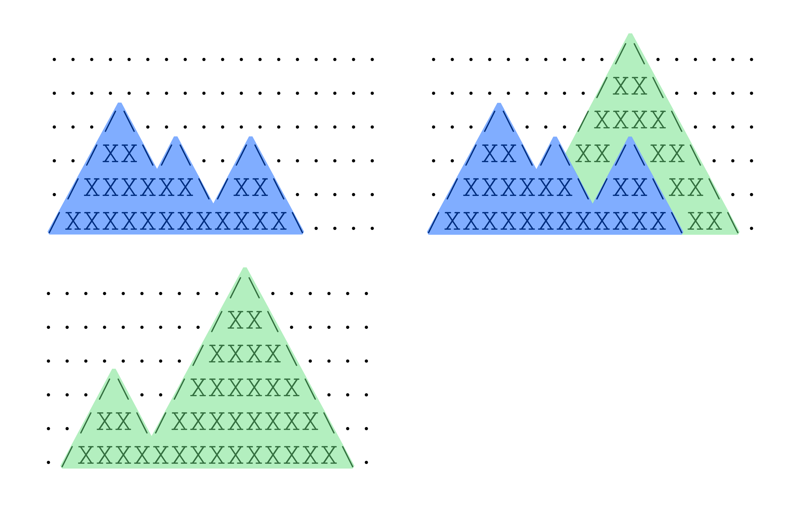

# ASCII-горы

## Условие задачи

Назовём рельефом гор 2D-изображение из $n$ строк и $m$ столбцов, состоящее только из символов $\texttt{X}$, $\texttt{.}$ (точка), $\texttt{/}$ (прямой слеш) и $\texttt{\textbackslash}$ (обратный слеш). Изображение составлено по следующим формальным правилам:

    • либо непосредственно слева снизу от символа $\texttt{/}$ находится такой же символ, либо непосредственно слева от символа $\texttt{/}$ находится символ $\texttt{\textbackslash}$, либо символ $\texttt{/}$ находится на нижней строке;
    • либо непосредственно справа сверху от символа $\texttt{/}$ находится такой же символ, либо непосредственно справа от символа $\texttt{/}$ находится символ $\texttt{\textbackslash}$;
    • либо непосредственно слева сверху от символа $\texttt{\textbackslash}$ находится такой же символ, либо непосредственно слева от символа $\texttt{\textbackslash}$ находится символ $\texttt{/}$;
    • либо непосредственно справа снизу от символа $\texttt{\textbackslash}$ находится такой же символ, либо непосредственно справа от символа $\texttt{\textbackslash}$ находится символ $\texttt{/}$, либо символ $\texttt{\textbackslash}$ находится на нижней строке;
    • каждый столбец содержит не более одного из символов $\texttt{/}$ и $\texttt{\textbackslash}$;
    • в каждом столбце все символы ниже $\texttt{/}$ и $\texttt{\textbackslash}$ равны $\texttt{X}$;
    • все остальные символы равны $\texttt{.}$.

Все символы, кроме $\texttt{.}$, являются частью горы.

В каждом рельефе гор есть хотя бы один символ, не равный $\texttt{.}$.

Дано $k$ рельефов по их близости к наблюдателю: от ближних к дальним. Выведите рельеф, видный наблюдателю. Если в некотором рельефе символ в $x$-й строке и $y$-м столбце является частью горы, то во всех более дальних от наблюдателя рельефах гор символы на этой позиции не видны наблюдателю.

## Входные данные

Каждый тест состоит из нескольких наборов входных данных. Первая строка содержит целое число $t$ ($1 \le t \le 20$) — количество наборов входных данных. Далее следует описание наборов входных данных.

Первая строка каждого набора содержит три целых числа $k$, $n$ и $m$ ($1 \le k, n \le 20$, $2 \le m \le 20$) — количество рельефов, высоту и ширину ASCII-арта. Далее следуют описания $k$ рельефов гор.

Описание рельефа гор состоит из $n$ строк, по $m$ символов в каждой — сам ASCII-арт. Описания рельефов разделены пустой строкой.

Иллюстрация к первому примеру из первого теста:


## Выходные данные

Для каждого набора входных данных выведите в $n$ строках рельеф гор, видный наблюдателю. После ответа на каждый набор входных данных выведите пустую строку.

## Пример теста 1

### Входные данные

```
3
2 6 18
..................
..................
.../\.............
../XX\/\../\......
./XXXXXX\/XX\.....
/XXXXXXXXXXXX\....

........../\......
........./XX\.....
......../XXXX\....
.../\../XXXXXX\...
../XX\/XXXXXXXX\..
./XXXXXXXXXXXXXX\.
1 2 2
..
/\
3 4 5
.....
.....
.....
./\..

.....
.....
./\..
/XX\.

.....
.....
../\.
./XX\


```

### Выходные данные

```
........../\......
........./XX\.....
.../\.../XXXX\....
../XX\/\XX/\XX\...
./XXXXXX\/XX\XX\..
/XXXXXXXXXXXX\XX\.

..
/\

.....
.....
./\\.
//\\\


```