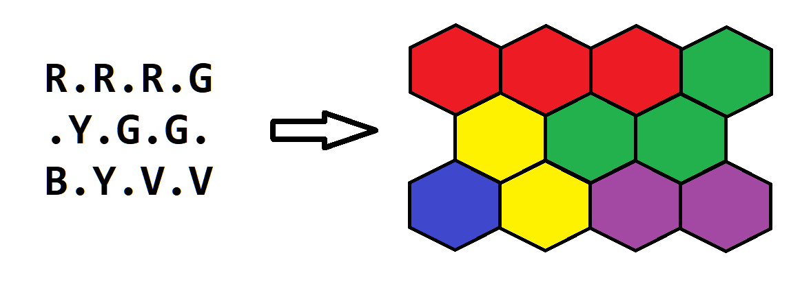
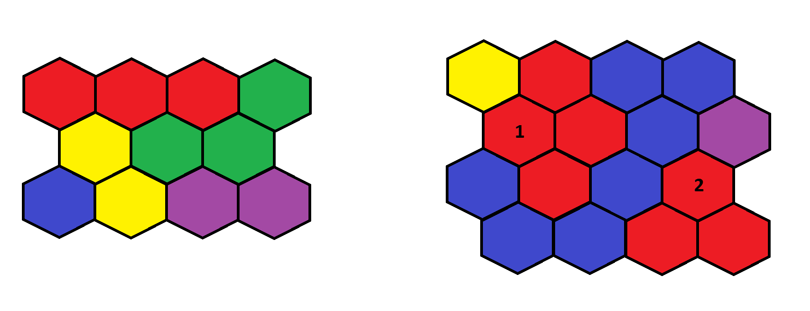

# Валидация карты

## Условие задачи

В этой задаче вам необходимо реализовать валидацию корректности карты для стратегической компьютерной игры.

Карта состоит из гексагонов (шестиугольников), каждый из которых принадлежит какому-то региону карты. В файлах игры карта представлена как $n$ строк по $m$ символов в каждой (строки и символы в них нумеруются с единицы). Каждый нечетный символ каждой четной строки и каждый четный символ каждой нечетной строки — точка (символ «.» с ASCII кодом 46); все остальные символы соответствуют гексагонам и являются заглавными буквами латинского алфавита. Буква указывает на то, какому региону принадлежит гексагон.

Посмотрите на картинку ниже, чтобы понять, как описание карты в файлах игры соответствует карте из шестиугольников.



*Соответствие описания карты в файле (слева) и самой карты (справа). Регионы $R$, $G$, $V$, $Y$ и $B$ окрашены в красный, зеленый, фиолетовый, желтый и синий цвет, соответственно.*

Вы должны проверить, что каждый регион карты является одной связной областью. Иными словами, не должно быть двух гексагонов, принадлежащих одному и тому же региону, которые не соединены другими гексагонами этого же региона.



*Карта слева является корректной. Карта справа не является корректной, так как гексагоны, обозначенные цифрами 1 и 2, принадлежат одному и тому же региону (обозначенному красным цветом), но не соединены другими гексагонами этого региона.*

Неполные решения этой задачи (например, недостаточно эффективные) могут быть оценены частичным баллом.

## Входные данные

В первой строке задано одно целое число $t$ ($1 \le t \le 100$) — количество наборов входных данных.

Первая строка набора входных данных содержит два целых числа $n$ и $m$ ($2 \le n, m \le 20$) — количество строк и количество символов в каждой строке в описании карты.

Далее следуют $n$ строк по $m$ символов в каждой — описание карты. Каждый нечетный символ каждой четной строки и каждый четный символ каждой нечетной строки — точка (символ «.» с ASCII кодом 46); все остальные символы соответствуют гексагонам и являются заглавными буквами латинского алфавита.

Первые два набора входных данных из примера показаны на второй картинке в условии.

## Выходные данные

На каждый набор входных данных выведите ответ в отдельной строке — $\texttt{YES}$, если каждый регион карты представляет связную область, или $\texttt{NO}$, если это не так.

## Пример теста 1

### Входные данные

```text
3
3 7
R.R.R.G
.Y.G.G.
B.Y.V.V
4 8
Y.R.B.B.
.R.R.B.V
B.R.B.R.
.B.B.R.R
2 7
G.B.R.G
.G.G.G.

```

### Выходные данные

```text
YES
NO
YES

```