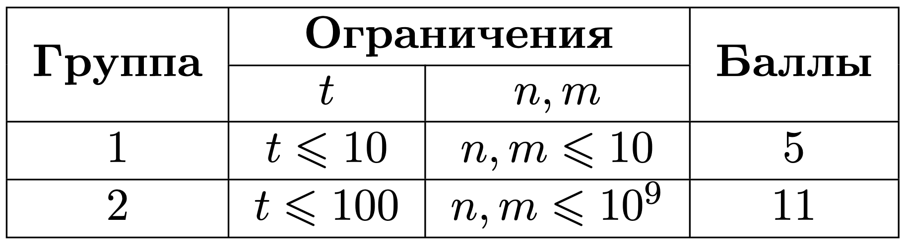
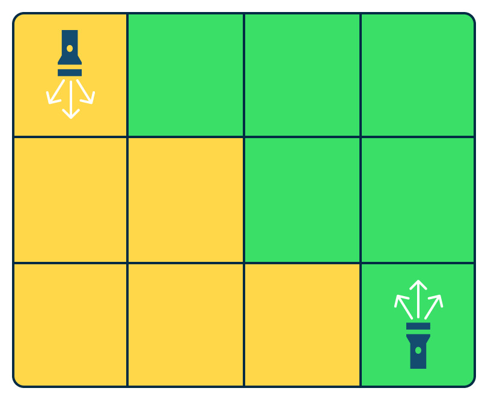
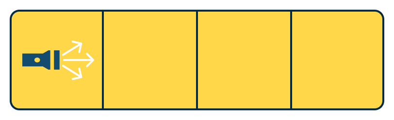
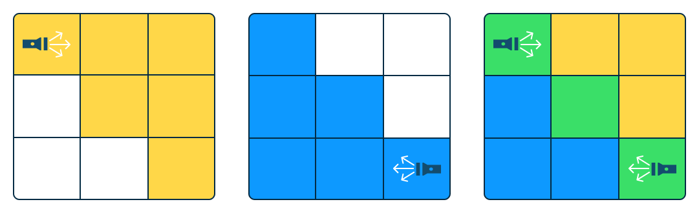

# Dark room

## Условие задачи

У Коли дома отключился свет, а он очень боится темноты, но, к счастью, с помощью фонариков можно осветить комнату. Помогите Коле узнать, сколько нужно фонариков и их координаты и направление, чтобы комната Коли была полностью освещена? 

Вам даётся комната размером $n$ в длину и $m$ в ширину. Вам нужно ввести $\textbf{минимальное}$ количество необходимых фонариков, а на следующих строках — их координаты и направление для полного освещения. В одной координате не может быть больше одного фонарика.

Координата в данной системе может быть охарактеризована в виде пары ($x$, $y$), $\text{ где:}$

       $x$ — координата по оси $X$, которая направлена вертикально вниз  от 1 до n;

       $y$ — координата по оси $Y$, которая направлена горизонтально вправо от 1 до $m$;

Если фонарик находится в координате ($i$, $j$), он освещает эту начальную координату. Затем, в зависимости от направления фонарика, рекурсивно освещает координаты:

- Если фонарик направлен вниз ($\texttt{D}$), освещаются координаты: ($i$+1, $j$-1), ($i$+1, $j$), ($i$+1, $j$+1).

- Если фонарик направлен вверх ($\texttt{U}$), освещаются координаты: ($i$-1, $j$-1), ($i$-1, $j$), ($i$-1, $j$+1).

- Если фонарик направлен влево ($\texttt{L}$), освещаются координаты: ($i$-1, $j$-1), ($i$, $j$-1), ($i$+1, $j$-1).

- Если фонарик направлен вправо ($\texttt{R}$), освещаются координаты:($i$-1, $j$+1), ($i$, $j$+1), ($i$+1, $j$+1).

Освещение фонарика двигается рекурсивно в том же направлении, пока луч не достигает стены.

## Входные данные

Первая строка содержит $t$ $(1 <= t <= 100)$ — количество наборов входных данных.

Целые числа $n$, $m$ $(1 <= n, m <= 10^9)$ — размер комнаты.


## Выходные данные

$n$ — количество фонариков;
$x$, $y$, $d$ — координата и направление.

Если существует несколько возможных ответов, вы можете вывести $\textbf{любой}$.

Иллюстрация к первому тестовому набору из примера:


Иллюстрация ко второму тестовому набору из примера:


Иллюстрация к третьему тестовому набору из примера:


## Пример теста 1

### Входные данные

```bash
3
3 4
1 4
3 3

```

### Выходные данные

```bash
2
1 1 D
3 4 U
1
1 1 R
2
1 1 R
3 3 L

```
