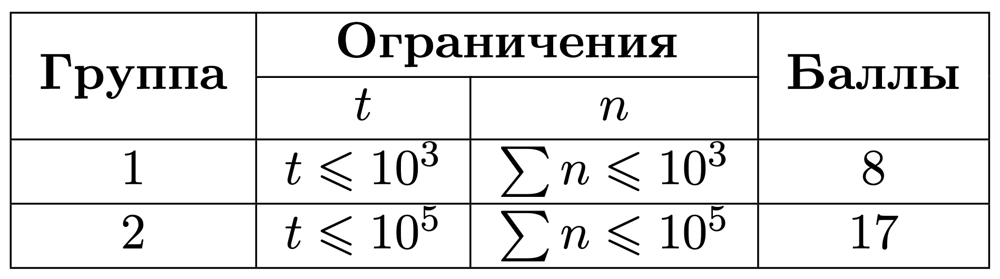

# Валидация

## Условие задачи

Ваш коллега получил задачу:

Дан список товаров. У каждого товара есть:

- название — непустая строка, состоящая из не более чем 10 строчных латинских букв;
- цена — целое число от 1 до $10^9$.

Все названия товаров уникальны.

По этому списку строится строчка, в которой перечислены названия товаров с ценами в любом порядке, но не должно быть двух товаров с одинаковой ценой. Например, если в исходном списке есть 2 или более товаров с одинаковой ценой, то в результирующей строке должен быть **${ровно\:один}$** из этих товаров. Если в списке есть товар с уникальной ценой, он обязательно должен быть перечислен в результирующей строке.

Требования к оформлению:

- товары в строке должны быть разделены символом $\texttt{,}$ (запятая);
- название и цена каждого товара должны быть разделены символом $\texttt{:}$ (двоеточие);
- пробелы и иные символы недопустимы;
- цена товара не содержит ведущих нулей.

Ваша задача — по исходному списку и строке определить, соответствует ли строка списку.

## Входные данные

Каждый тест состоит из нескольких наборов входных данных.

Первая строка содержит целое число $t$ $(1 \le t \le 10^5)$ — количество наборов входных данных.

Далее следуют описания наборов входных данных.

Первая строка каждого набора входных данных содержит целое число $n$ $(1 \le n \le 10^5)$ — количество товаров в списке.

Следующие $n$ строк каждого набора входных данных содержат строку $name_i$ и целое число $price_i$, разделенные пробелом — название и стоимость товара. Название товара непустое, состоит из не более чем 10 строчных латинских букв. Стоимость товара положительная и не превосходит $10^9$. Все названия товаров уникальны.

Последняя строка каждого набора входных данных содержит строку, которую сгенерировал ваш коллега. Гарантируется, что эта строка непустая и содержит только цифры, строчные латинские буквы, запятые и двоеточия.

Гарантируется, что сумма $n$ по всем наборам входных данных не превосходит $10^5$. Гарантируется, что сумма длин всех сгенерированных строк не больше 3 Мб.


## Выходные данные

Выведите $t$ строк, $i$-я из них должна содержать ответ на $i$-й набор входных данных — $\texttt{YES}$ или $\texttt{NO}$.

В третьем наборе входных данных в строке нет товара с ценой 1.

В четвертом наборе входных данных в строке нет товара с ценой 2.

В пятом наборе входных данных в строке есть несуществующий товар $\texttt{b}$ с ценой 1.

В шестом наборе входных данных в строке есть несуществующий товар $\texttt{d}$ с ценой 4.

В седьмом наборе входных данных строка не соответствует формату.

В восьмом наборе входных данных в строке нет товара с ценой 1.

В девятом наборе входных данных в строке цена товара $\texttt{abc}$ содержит ведущие нули.

## Пример теста 1

### Входные данные

```bash
9
3
a 1
b 2
c 3
a:1,c:3,b:2
3
a 1
b 2
c 2
c:2,a:1
3
a 1
b 2
c 2
b:2,c:2
3
a 1
b 2
c 2
a:1,a:1,a:1,a:1
3
a 1
b 2
c 2
b:1
3
a 1
b 2
c 2
d:4,a:1,c:2
3
a 1
b 2
c 2
abcdef
3
a 1
b 2
c 2
a:12345678901234567890,c:2
1
abc 123
abc:0123

```

### Выходные данные

```bash
YES
YES
NO
NO
NO
NO
NO
NO
NO

```
