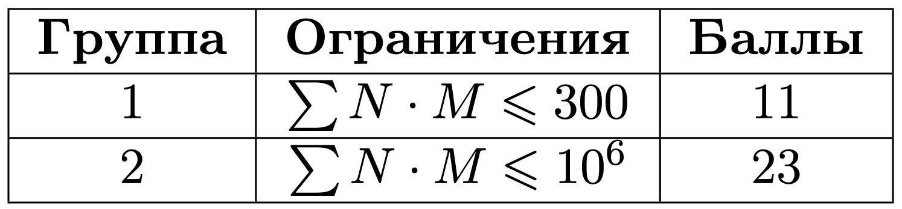
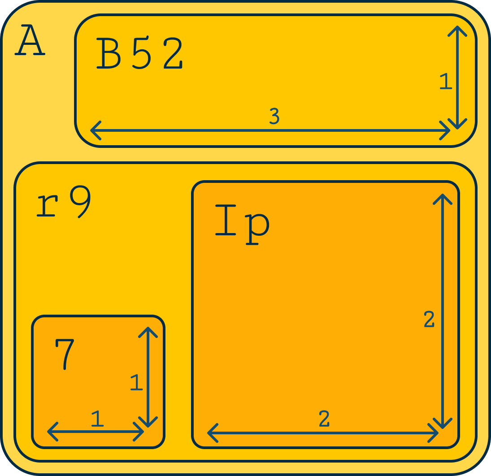

# Коробки. Коробки. Коробки

## Условие задачи

Вы работаете в компании, занимающейся логистикой и доставкой товаров. Ваша задача — разработать систему для отслеживания перемещения коробок внутри склада.

Коробка размером $a$ на $b$ представлена в матрице из ASCII-символов в виде прямоугольника, где $a$ символов в ширину и $b$ символов в длину (см. пример). Коробки также могут быть вложены друг в друга для удобства транспортировки и хранения. Каждая коробка в левом верхнем углу имеет уникальный номер, состоящий из букв латинского алфавита и цифр, длиной не больше 3 символов.

Чтобы было удобнее хранить данные о перемещении коробок, представьте все коробки, учитывая их вложенность друг в друга, в формате JSON. А для коробок, в которых нет вложенных коробок, выведите их площадь (см.пример).

## Входные данные

Каждый тест состоит из нескольких наборов входных данных.

Первая строка содержит целое число $t$ ($1 \le t \le 10^4$) — количество наборов входных данных.

Первая строка каждого набора входных данных состоит из двух целых чисел $N$ и $M$. ($3 \le N, M \le 3\cdot 10^5$). Гарантируется, что сумма $N \cdot M$ по всем тестам не больше $10^6$.

Далее описана матрица из $N$ строк по $M$ символов каждая.

Матрица состоит из символов $\texttt{«.»}$, $\texttt{«+»}$, $\texttt{«-»}$, $\texttt{«|»}$ для описания коробок, а также латинских символов и цифр для описания названий коробок. Коробки не пересекаются и не совпадают по своим границам.



## Выходные данные

Выведите структуру коробок в формате JSON, где для коробок без вложенности представлена их площадь. Порядок вывода коробок внутри одной коробки не имеет значения.

Размер выходных данных не должен превосходить 20МБ.

Иллюстрация к первому набору из примера:



## Пример теста 1

### Входные данные

```bash
5
11 12
+----------+
|A+---+....|
|.|B52|....|
|.+---+....|
|+-------+.|
||r9.+--+|.|
||+-+|Ip||.|
|||7||..||.|
||+-++--+|.|
|+-------+.|
+----------+
3 3
...
...
...
3 5
+---+
|I63|
+---+
8 9
+------+.
|256...|.
|......|.
|......|.
+------+.
....+---+
....|R..|
....+---+
3 9
+-++-++-+
|2||5||6|
+-++-++-+

```

### Выходные данные

```bash
[
  {
    \"A\": {
      \"B52\": 3,
      \"r9\": {
        \"7\": 1,
        \"Ip\": 4
      }
    }
  },
  {},
  {
    \"I63\": 3
  },
  {
    \"256\": 18,
    \"R\": 3
  },
  {
    \"2\": 1,
    \"5\": 1,
    \"6\": 1
  }
]

```
